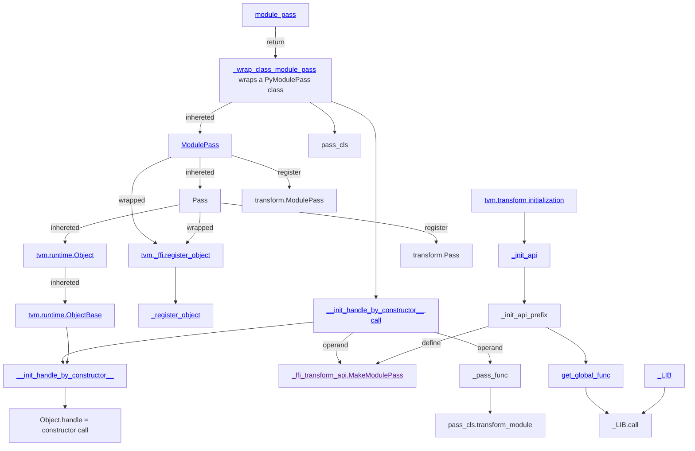

## Build
For using the out-dated `llvm-config`:
```sh
git clone https://aur.archlinux.org/ncurses5-compat-libs.git
cd ncurses5-compat-libs/
gpg --recv-keys CC2AF4472167BE03
makepkg -sir
```

```sh
conda create -n bitblas python=3.9
conda activate bitblas
conda install gcc_linux-64 gxx_linux-64
conda install cuda -c nvidia/label/cuda-12.1
pip install --pre torch torchvision torchaudio --index-url https://download.pytorch.org/whl/nightly/cu121
conda install cmake
python setup.py build
```

For running TVM Python interface:
```sh
pip install decorator psutil attrs thefuzz pytest tqdm
export CUDA_DEVICE_ORDER=PCI_BUS_ID
```

To test:
```sh
cd build/lib
python -c "import bitblas; print(bitblas.__version__)"
```

## Hello World
1. Make changes
2. `python setup.py build`
3. `python my_test.py`

To avoid build C++, comment `build_tvm(llvm_path)` in `BitBLASBuilPydCommand` of `setup.py`.

## Code Structure 
`tvm` is imported from `BitBLAS/build/lib/bitblas/3rdparty/tvm/python`.
bitblas-related modules are imported from `BitBLAS/python/bitblas`.

Overall:

```mermaid
graph TD;
   bitblas_bitnet_example[<a href="">bitblas_bitnet_example</a>]
   bitblas_matmul_init[<a href="https://github.com/w32zhong/BitBLAS/blob/5674b605d07649b2f16810a0fb0b5745ab63203f/integration/BitNet/utils_quant.py#L77">BitLinear.bitblas_matmul = Matmul of Operator parent</a>]
   bitblas_matmul[<a href="https://github.com/w32zhong/BitBLAS/blob/5674b605d07649b2f16810a0fb0b5745ab63203f/integration/BitNet/utils_quant.py#L144">BitLinear.bitblas_matmul.forward</a>]
   transform_weight_call[<a href="https://github.com/w32zhong/BitBLAS/blob/5674b605d07649b2f16810a0fb0b5745ab63203f/integration/BitNet/utils_quant.py#L92-L93">BitLinear.bitblas_matmul.transform_weight call in post_process_weights</a>]
   transform_weight[<a href="https://github.com/w32zhong/BitBLAS/blob/10039dd848f3f43b0170670f49b83dfe9a7c0a12/python/bitblas/ops/general_matmul.py#L409">BitLinear.bitblas_matmul.transform_weight</a>]
   general_compress[<a href="https://github.com/w32zhong/BitBLAS/blob/b6cc2e798af0a487b5e953c8c6fef309d54beea7/python/bitblas/quantization/utils.py#L54">general_compress</a>]
   bitblas_bitnet_example --> bitblas_matmul_init
   bitblas_matmul_init --> bitblas_matmul
   bitblas_matmul_init --> transform_weight_call --> transform_weight --> general_compress

   matmul_init[<a href="https://github.com/w32zhong/BitBLAS/blob/1f3e28e96d83d984ea8195ac1420cc834c035d18/python/bitblas/ops/general_matmul.py#L209">Matmul.__init__</a>]
   matmul_forward[<a href="https://github.com/w32zhong/BitBLAS/blob/1f3e28e96d83d984ea8195ac1420cc834c035d18/python/bitblas/ops/general_matmul.py#L482">Matmul.forward</a>]
   _forward_from_prebuild_lib[<a href="https://github.com/w32zhong/BitBLAS/blob/1f3e28e96d83d984ea8195ac1420cc834c035d18/python/bitblas/ops/operator.py#L287">Operator._forward_from_prebuild_lib</a>]
   operator_libcall[<a href="https://github.com/w32zhong/BitBLAS/blob/1f3e28e96d83d984ea8195ac1420cc834c035d18/python/bitblas/ops/operator.py#L292">Operator.lib.call of forward values</a>]
   _build_default_module_call[<a href="https://github.com/w32zhong/BitBLAS/blob/efa02a4603a63a35007ad9727d940a7f76097dbb/python/bitblas/ops/general_matmul.py#L251">Matmul._build_default_module call</a>]
   _build_default_module[<a href="https://github.com/w32zhong/BitBLAS/blob/e3695e23f9ccceb60a5957d62632604fa292509e/python/bitblas/ops/general_matmul.py#L353">Matmul._build_default_module</a>]
   _build_runtime_module[<a href="https://github.com/w32zhong/BitBLAS/blob/9f2169992a50a6a5cd451f6d9cbc7439debaf0ab/python/bitblas/ops/operator.py#L73">Operator._build_runtime_module</a>]
   operator_lib_init_call[<a href="https://github.com/w32zhong/BitBLAS/blob/9f2169992a50a6a5cd451f6d9cbc7439debaf0ab/python/bitblas/ops/operator.py#L139">Operator.lib = self.wrapper.load_lib call</a>]
   tvm_build_call[<a href="https://github.com/w32zhong/BitBLAS/blob/9f2169992a50a6a5cd451f6d9cbc7439debaf0ab/python/bitblas/ops/operator.py#L108">tvm.build call of self.optimized_func</a>]
   bitblas_matmul_init --> matmul_init
   matmul_init --> _build_default_module_call --> _build_default_module --> _build_runtime_module --> GPU --> operator_lib_init_call --> operator_libcall
   bitblas_matmul --> matmul_forward --> _forward_from_prebuild_lib --> operator_libcall
   _build_runtime_module --> CPU --> tvm_build_call
   tvm_build_call --> Operator.rt_mod
   tvm_build_call --> Operator.function_handle
   tvm_build_call --> Operator.torch_func

   apply_default_schedule_call[<a href="https://github.com/w32zhong/BitBLAS/blob/b6cc2e798af0a487b5e953c8c6fef309d54beea7/python/bitblas/ops/general_matmul.py#L355">Matmul.optimized_func = apply_default_schedule of self.prim_func_mod</a>]
   apply_default_schedule[<a href="https://github.com/w32zhong/BitBLAS/blob/b6cc2e798af0a487b5e953c8c6fef309d54beea7/python/bitblas/ops/operator.py#L147">Operator.apply_default_schedule</a>]
   ApplyDefaultSchedule[<a href="https://github.com/w32zhong/BitBLAS/blob/14a6cae5f06d3100b1a6fe1bbadbee96fe4cccaf/python/bitblas/base/transform.py#L37">ApplyDefaultSchedule</a>]
   _select_implementation_call[<a href="https://github.com/w32zhong/BitBLAS/blob/1f3e28e96d83d984ea8195ac1420cc834c035d18/python/bitblas/ops/operator.py#L48">Operator.prim_func_mod = self._select_implementation</a>]
   _select_implementation[<a href="https://github.com/w32zhong/BitBLAS/blob/7f325cceb390f15bd676104143f09b9755c19596/python/bitblas/ops/general_matmul.py#L364">‎Matmul._select_implementation</a>]
   weight_dequantize_implementation[<a href="https://github.com/w32zhong/BitBLAS/blob/7f325cceb390f15bd676104143f09b9755c19596/python/bitblas/ops/impl/matmul_dequantize_impl.py#L559">weight_dequantize_implementation imported from select_implementation</a>]
   matmul_nt_dequantize_b[<a href="https://github.com/w32zhong/BitBLAS/blob/7f325cceb390f15bd676104143f09b9755c19596/python/bitblas/ops/impl/matmul_dequantize_impl.py#L19">matmul_nt_dequantize_b</a>]
   construct_tvm_graph[<a href="https://github.com/w32zhong/BitBLAS/blob/7f325cceb390f15bd676104143f09b9755c19596/python/bitblas/ops/impl/matmul_dequantize_impl.py#L131">te.compute call</a>]

   _build_default_module --> apply_default_schedule_call --> apply_default_schedule --> ApplyDefaultSchedule -->|wrapped| module_pass
   matmul_init --> _select_implementation_call --> _select_implementation --> weight_dequantize_implementation --> matmul_nt_dequantize_b --> construct_tvm_graph
```


For `module_pass`:


Important functions:
* [`post_process_weights`](https://github.com/w32zhong/BitBLAS/blob/5674b605d07649b2f16810a0fb0b5745ab63203f/integration/BitNet/utils_quant.py#L89) calls `weight_quant` on weights and do `transform_weight`.
* [`weight_quant`](https://github.com/w32zhong/BitBLAS/blob/5674b605d07649b2f16810a0fb0b5745ab63203f/integration/BitNet/utils_quant.py#L92) scale down and clamp to [-1, 1] using mean value before creating a ternary net.
* [`transform_weight`](https://github.com/w32zhong/BitBLAS/blob/10039dd848f3f43b0170670f49b83dfe9a7c0a12/python/bitblas/ops/general_matmul.py#L409) compress an integer matrix to a compact matrix of `W_dtype`


What is re-scaling? Below is the extracted [example code](https://github.com/w32zhong/BitBLAS/blob/main/docs/QuickStart.md#example-w_int4a_fp16-mixed-precision-matrix-multiplication).
```py
group_size = 128
input_shape = (1, 1024)
weight_shape = (1024, 1024)
scaling_shape = (1024, 1024 // 128)
zeros_shape = (1024, 1024 // 128)
output_shape = (1, 1024)

scaling = torch.rand(scaling_shape, dtype=torch.float16).cuda()
zeros = torch.rand(zeros_shape, dtype=torch.float16).cuda()

# Compute reference result with manual scaling and zero-point adjustment
# rescale = (weight - zeros) * scaling
for i in range(in_features // group_size): # group number i in range(8)
    for j in range(group_size): # group j-th element/column
         # within each group, we use the same zeros and scaling factors.
         rescaling_tensor[:, i*group_size+j] = (weight_tensor[:, i*group_size+j] - zeros[:, i]) * scaling[:, i]
```

Below is the `prim_func` generated for `A_dtype="float16"` activations and `W_dtype="uint4"` weights:
```py
# from tvm.script import ir as I
# from tvm.script import tir as T

@I.ir_module
class Module:
    @T.prim_func
    def main(
      A: T.Buffer((1, 1024), "float16"),
      B: T.Buffer((1024, 512), "int8"), Scale: T.Buffer((1024, 8), "float16"),
      Zeros: T.Buffer((1024, 8), "float16"),
      D: T.Buffer((1, 1024), "float16")):
        # with T.block("root"):
        B_decode = T.alloc_buffer((1024, 1024), "float16")
        C = T.alloc_buffer((1, 1024), "float16")
        for n, k in T.grid(1024, 1024):
            with T.block("B_decode"):
                v_n, v_k = T.axis.remap("SS", [n, k]) # “S” (for spatial), “R” (for reduction)
                T.reads(B[v_n, v_k // 2], Zeros[v_n, v_k // 128], Scale[v_n, v_k // 128])
                T.writes(B_decode[v_n, v_k])
                B_decode[v_n, v_k] = # decompressing B
                  (
                     T.Cast("float16", T.bitwise_and(
                        T.shift_right(B[v_n, v_k // 2], T.Cast("int8", v_k % 2 * 4)),
                        T.int8(15) # b1111
                     ))
                     -
                     Zeros[v_n, v_k // 128] # re-centering
                  )
                  * Scale[v_n, v_k // 128] # scaling 
        for i, j, k in T.grid(1, 1024, 1024):
            with T.block("C"):
                v_i, v_j, v_k = T.axis.remap("SSR", [i, j, k])
                T.reads(A[v_i, v_k], B_decode[v_j, v_k])
                T.writes(C[v_i, v_j])
                with T.init():
                    C[v_i, v_j] = T.float16(0)
                C[v_i, v_j] = C[v_i, v_j] + A[v_i, v_k] * B_decode[v_j, v_k] # matrix multiplication
        for i, j in T.grid(1, 1024):
            with T.block("D"):
                v_i, v_j = T.axis.remap("SS", [i, j])
                T.reads(C[v_i, v_j])
                T.writes(D[v_i, v_j])
                D[v_i, v_j] = C[v_i, v_j]

```

## Code Example
Without re-scaling:
```py
import sys
import os
path = os.path.join("/home/tk/Desktop/bitblas/BitBLAS", "./build/lib")
sys.path.insert(0, path)
import torch
import bitblas

class TvmLinear():
    def __init__(self, in_features, out_features, W_dtype="uint4"):
        matmul_config = bitblas.MatmulConfig(
            M=1,
            K=in_features,
            N=out_features,
            A_dtype="float16",  # activation A dtype
            W_dtype=W_dtype,  # weight W dtype
            accum_dtype="float16",  # accumulation dtype
            out_dtype="float16",  # output dtype
            layout="nt",
            with_bias=False,
            group_size=-1, # 128,  # setting for grouped quantization
            with_scaling=False,  # setting for scaling factor
            with_zeros=False,  # setting for zeros
            zeros_mode="original",  # setting for how to calculating zeros
        )
        self.matmul = bitblas.Matmul(config=matmul_config)
        init_W = torch.randint(0, 7, (out_features, in_features), dtype=torch.int8).cuda()
        self.set_weight(init_W)

    def set_weight(self, origin_int_W):
        self.W = self.matmul.transform_weight(origin_int_W)
        self.W_ori = origin_int_W

    def forward(self, A):
        output = self.matmul(A, self.W)
        verify = A @ self.W_ori.T.half()
        assert torch.allclose(output, verify, atol=1e-2)
        return output


inp = torch.rand((1, 8), dtype=torch.float16).cuda()
new_module = TvmLinear(8, 5)
out = new_module.forward(inp)
```

With re-scaling:
```py
class TvmLinear():
    def __init__(self, in_features, out_features, W_dtype="uint4", group_size=128):
        matmul_config = bitblas.MatmulConfig(
            M=1,
            K=in_features,
            N=out_features,
            A_dtype="float16",  # activation A dtype
            W_dtype=W_dtype,  # weight W dtype
            storage_dtype='int8',
            accum_dtype="float16",  # accumulation dtype
            out_dtype="float16",  # output dtype
            layout="nt",
            with_bias=False,
            group_size=group_size,
            with_scaling=True,  # setting for scaling factor
            with_zeros=True,  # setting for zeros
            zeros_mode="rescale",  # setting for how to calculating zeros
        )
        self.group_size = group_size
        self.matmul = bitblas.Matmul(config=matmul_config)
        # set random initial (binary) weights
        init_W = torch.randint(0, 2, (out_features, in_features), dtype=torch.int8).cuda()
        #self._set_quantized_weight(init_W)
        self.bits = int(''.join(list(filter(str.isdigit, W_dtype))))
        self.scaling = None
        self.zeros = None

    def _set_quantized_weight(self, W_quant):
        self.W_store = self.matmul.transform_weight(W_quant)
        self.W_quant = W_quant
        breakpoint()

    def set_weight(self, W):
        out_features, in_features = W.shape
        assert in_features % self.group_size == 0

        reshape = (out_features, -1, self.group_size)
        W_reshape = W.reshape(*reshape)
        group_max = W_reshape.max(-1).values
        group_min = W_reshape.min(-1).values
        group_max = group_max.unsqueeze(-1).expand(reshape)
        group_min = group_min.unsqueeze(-1).expand(reshape)
        #Q_min = -(2**(self.bits - 1))
        #Q_max = 2**(self.bits - 1) - 1
        Q_min = 0
        Q_max = 2**(self.bits) - 1
        ratio = (Q_max - Q_min) / (group_max - group_min)

        W_quant = ((W_reshape - group_min) * ratio).round() + Q_min
        W_quant = W_quant.to(dtype=torch.long)
        W_quant = W_quant.reshape(W.shape)
        self._set_quantized_weight(W_quant)

        self.scaling = 1 / ratio[:,:,0]
        self.zeros = Q_min * self.scaling - group_min[:,:,0]

        self.debug_scaling = self.scaling.unsqueeze(-1).expand(reshape).reshape(W.shape)
        self.debug_zeros = self.zeros.unsqueeze(-1).expand(reshape).reshape(W.shape)
        self.debug_W = W_quant.float() * self.debug_scaling - self.debug_zeros

    def forward(self, A):
        output = self.matmul(A, self.W_store, scale=self.scaling, zeros=self.zeros)
        return output


inp = torch.rand((1, 8), dtype=torch.float16).cuda()
M = TvmLinear(8, 5, group_size=4)

W = torch.rand((5, 8), dtype=torch.float16).cuda()
M.set_weight(W)

out = M.forward(inp)
print('inp', inp)
print('W', W)
print('out', out)

assert torch.allclose(
    M.debug_W.T.half(),
    W.T,
    atol=1e-1
)
assert torch.allclose(
    inp @ M.debug_W.T.half(),
    inp @ W.T,
    atol=1e-1
)

B_decode = W.clone()
B_early = M.W_quant.clone()
B = M.W_store # (5, 4)
Scale = M.scaling
Zeros = M.zeros
for v_n in range(5):
    for v_k in range(8):
        a = B[v_n, v_k // 2] >> (v_k % 2 * 4)
        b = torch.tensor(15, device='cuda:0', dtype=torch.int8).cuda()
        c = a & b
        B_early[v_n, v_k] = c
        B_decode[v_n, v_k] = c * Scale[v_n, v_k // 4] - Zeros[v_n, v_k // 4]
```

https://www.simonv.fr/TypesConvert/?integers
