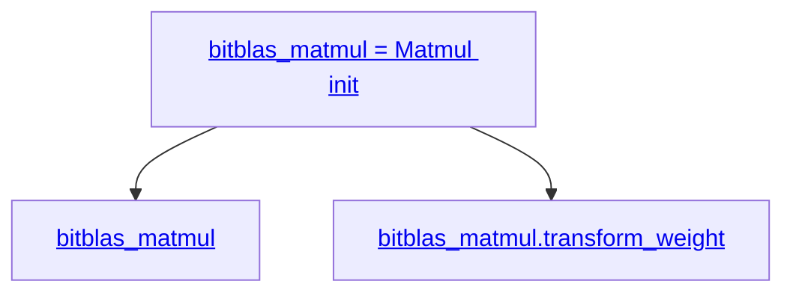

## Build
For using the out-dated `llvm-config`:
```sh
git clone https://aur.archlinux.org/ncurses5-compat-libs.git
cd ncurses5-compat-libs/
gpg --recv-keys CC2AF4472167BE03
makepkg -sir
```

```sh
conda create -n bitblas python=3.9
conda activate bitblas
conda install gcc_linux-64 gxx_linux-64
conda install cuda -c nvidia/label/cuda-12.1
pip install --pre torch torchvision torchaudio --index-url https://download.pytorch.org/whl/nightly/cu121
conda install cmake
python setup.py build
```

For running TVM Python interface:
```sh
pip install decorator psutil attrs thefuzz pytest tqdm
export CUDA_DEVICE_ORDER=PCI_BUS_ID
```

To test:
```sh
cd build/lib
python -c "import bitblas; print(bitblas.__version__)"
```

## Hello World
1. Make changes
2. `python setup.py build`
3. `python my_test.py`

To avoid build C++, comment `build_tvm(llvm_path)` in `BitBLASBuilPydCommand` of `setup.py`.

## Code Structure 
`tvm` is imported from `BitBLAS/build/lib/bitblas/3rdparty/tvm/python`.
bitblas-related modules are imported from `BitBLAS/python/bitblas`.

* [BitNet-1.58 forward](https://github.com/w32zhong/BitBLAS/blob/5674b605d07649b2f16810a0fb0b5745ab63203f/integration/BitNet/utils_quant.py#L143-L144)
* [BitNet-1.58 transform weights](https://github.com/w32zhong/BitBLAS/blob/5674b605d07649b2f16810a0fb0b5745ab63203f/integration/BitNet/utils_quant.py#L92-L93)
* [BitNet-1.58 MatMul](https://github.com/w32zhong/BitBLAS/blob/5674b605d07649b2f16810a0fb0b5745ab63203f/integration/BitNet/utils_quant.py#L77)
* [Declare Matmul](https://github.com/w32zhong/BitBLAS/blob/f4dc3032c27ff0d377a40bf14d6f2c3e6c52c470/python/bitblas/__init__.py#L35)
* [Matmul](python/bitblas/ops/general_matmul.py#L184)
* [Matmul:forward](python/bitblas/ops/general_matmul.py#L480)
* [Matmul:forward\_from\_prebuild\_lib](python/bitblas/ops/operator.py#L287)
* lib init call stack:
    * [Matmul:`__init__` calls `_build_default_module`](python/bitblas/ops/general_matmul.py#L249), sets `optimized_func` to `prim_func_mod`.
    * [Matmul:`_build_default_module` calls `_build_runtime_module`](python/bitblas/ops/general_matmul.py#L360)
    * [Matmul:`_build_runtime_module`](python/bitblas/ops/operator.py#L73) calls tvm.build(`optimized_func`) and self.lib.init()
* initial `prim_func_mod`:
    * [`Operator.prim_func_mod = self._select_implementation()`](python/bitblas/ops/operator.py#L48)
    * [`Matmul._select_implementation`](python/bitblas/ops/general_matmul.py#L362) uses `weight_dequantize_implementation` which is imported from below `select_implementation`:
    * [`select_implementation`](python/bitblas/ops/impl/matmul_dequantize_impl.py#L559)
    * [`matmul_nt_dequantize_b`](python/bitblas/ops/impl/matmul_dequantize_impl.py#L19)
* Apply optimizations
    * [`build_default_module`](python/bitblas/ops/general_matmul.py#L353) calls `apply_default_schedule`
    * [`apply_default_schedule`](python/bitblas/ops/operator.py#L147) calls `bitblas.ApplyDefaultSchedule`
    * [`bitblas.ApplyDefaultSchedule`](python/bitblas/base/transform.py#L37) is wrapped by `@module_pass`
    * [`module_pass`](https://github.com/LeiWang1999/tvm/tree/618306ce3baa2c606d43856afbe6655e4e67b2c8/python/tvm/ir/transform.py#L326) is defined in `svm`
    * in `module_pass`, a function called `create_module_pass` is returned.
    * At the place of `ApplyDefaultSchedule` class declaration, `name=ApplyDefaultSchedule, pass_arg=<class 'bitblas.base.transform.ApplyDefaultSchedule'>`
    * and the class is wrapped by `_wrap_class_module_pass`:
    ```py
    info = PassInfo(opt_level, fname, required, traceable)
    return _wrap_class_module_pass(pass_arg, info)
    ```
    * [`_wrap_class_module_pass`](https://github.com/LeiWang1999/tvm/tree/618306ce3baa2c606d43856afbe6655e4e67b2c8/python/tvm/ir/transform.py#L293) wraps a `PyModulePass(ModulePass)` class
    * At the time of class initialization, the `PyModulePass.__init__` will serve as a proxy of `ApplyDefaultSchedule.__init__` by calling `inst = pass_cls(*args, **kwargs)`
    * the seemingly most important work for class wrapper is that it additionally calls [`self.__init_handle_by_constructor__(...)`](https://github.com/LeiWang1999/tvm/tree/618306ce3baa2c606d43856afbe6655e4e67b2c8/python/tvm/ir/transform.py#L309)
    * the [`ModulePass`](https://github.com/LeiWang1999/tvm/blob/618306ce3baa2c606d43856afbe6655e4e67b2c8/python/tvm/ir/transform.py#L242) class is registered by `@tvm._ffi.register_object`:
    ```py
    @tvm._ffi.register_object("transform.Pass")
    class Pass(tvm.runtime.Object):
       def __call__(self, mod):
           return _ffi_transform_api.RunPass(self, mod)
      
    @tvm._ffi.register_object("transform.ModulePass")
    class ModulePass(Pass):
       pass
    ```
    * according to TVM FFI (Foreign Function Interface) [`tvm._ffi.register_object`](https://github.com/LeiWang1999/tvm/blob/618306ce3baa2c606d43856afbe6655e4e67b2c8/python/tvm/_ffi/registry.py#L41-L82), the `register_object` is defined as (`object_name=type_key='transform.ModulePass'`)
    ```py
    def register_object(type_key=None):
       object_name = type_key if isinstance(type_key, str) else type_key.__name__
   
       def register(cls):
           """internal register function"""
           if hasattr(cls, "_type_index"):
               tindex = cls._type_index
           else: # will go here in our case
               tidx = ctypes.c_uint()
               if not _RUNTIME_ONLY:
                   check_call(_LIB.TVMObjectTypeKey2Index(c_str(object_name), ctypes.byref(tidx))) # will go here in our case
               else:
                   # directly skip unknown objects during runtime.
                   ret = _LIB.TVMObjectTypeKey2Index(c_str(object_name), ctypes.byref(tidx))
                   if ret != 0:
                       return cls
               tindex = tidx.value # equal to 164 in our case.
           _register_object(tindex, cls)
           return cls
   
       if isinstance(type_key, str):
           return register # will go here in our case
   
       return register(type_key)
    ```
    * in our case, when `tvm.ir.transform.ModulePass` is passed into `register(cls)` above, and `_register_object(tindex, cls)` is called.
    * `_register_object` is imported from [here](https://github.com/LeiWang1999/tvm/blob/618306ce3baa2c606d43856afbe6655e4e67b2c8/python/tvm/_ffi/registry.py#L25-L38) and ctype.object is imported [`from ._ctypes.object`](https://github.com/LeiWang1999/tvm/blob/618306ce3baa2c606d43856afbe6655e4e67b2c8/python/tvm/_ffi/_ctypes/object.py#L42)
    * On the other hand, `tvm.runtime.Object` is defined [here](https://github.com/LeiWang1999/tvm/blob/618306ce3baa2c606d43856afbe6655e4e67b2c8/python/tvm/runtime/object.py#L49) which is also inhered from [`ObjectBase`](https://github.com/LeiWang1999/tvm/blob/618306ce3baa2c606d43856afbe6655e4e67b2c8/python/tvm/_ffi/_ctypes/object.py#L114) which has the `__init_handle_by_constructor__` member function.
* [__init_handle_by_constructor__](https://github.com/LeiWang1999/tvm/tree/618306ce3baa2c606d43856afbe6655e4e67b2c8/python/tvm/ir/transform.py#L309) function calling
    * the first argument is `_ffi_transform_api.MakeModulePass` which is initialized from [`tvm._ffi._init_api("transform", "tvm.ir._ffi_transform_api")`](https://github.com/LeiWang1999/tvm/tree/618306ce3baa2c606d43856afbe6655e4e67b2c8/python/tvm/ir/_ffi_transform_api.py). Following `tvm._ffi.__init__.py` we can find `_init_api` is defined [here](https://github.com/LeiWang1999/tvm/tree/618306ce3baa2c606d43856afbe6655e4e67b2c8/python/tvm/_ffi/registry.py#L299) and it internally calls `_init_api_prefix("tvm.ir._ffi_transform_api", prefix="transform")` in this case to bind the foreign function:
    ```py
    def _get_api(f):
       flocal = f
       flocal.is_global = True
       return flocal
    
    def _init_api_prefix(module_name, prefix):
       module = sys.modules[module_name]
   
       for name in list_global_func_names():
           if not name.startswith(prefix):
               continue
           # in this case, name = 'transform.MakeModulePass'   
           fname = name[len(prefix) + 1 :] # 'MakeModulePass'
           target_module = module # module 'tvm.ir._ffi_transform_api'
   
           if fname.find(".") != -1:
               continue
           f = get_global_func(name) # calls _get_global_func in 3rdparty/tvm/python/tvm/_ffi/_ctypes/packed_func.py
           ff = _get_api(f) # see definition above
           ff.__name__ = fname
           ff.__doc__ = "TVM PackedFunc %s. " % fname
           setattr(target_module, ff.__name__, ff)
    ```
    * where the [`get_global_func`](https://github.com/LeiWang1999/tvm/tree/618306ce3baa2c606d43856afbe6655e4e67b2c8/python/tvm/_ffi/_ctypes/packed_func.py:L286) is internally calling [`_load_lib`](https://github.com/LeiWang1999/tvm/tree/618306ce3baa2c606d43856afbe6655e4e67b2c8/python/tvm/_ffi/base.py:L63) via `lib = ctypes.CDLL(lib_path[0], ctypes.RTLD_GLOBAL)` by loading dynamic library from `BitBLAS/build/lib/bitblas/3rdparty/tvm/build/libtvm.so`.
    * the 2nd argument is a function `_pass_func(mod, ctx)` that simply calls [`inst.transform_module(mod, ctx)`](https://github.com/LeiWang1999/tvm/tree/618306ce3baa2c606d43856afbe6655e4e67b2c8/python/tvm/ir/transform.py#L306). If you unwrap the decorators, in the case of `ApplyDefaultSchedule`, it is [ApplyDefaultSchedule.transform_module](https://github.com/w32zhong/BitBLAS/blob/main/python/bitblas/base/transform.py#L50).
    * the 3rd argument is of type `tvm.ir.transform.PassInfo` which in this case is formated in string `The meta data of the pass - pass name: ApplyDefaultSchedule, opt_level: 0, required passes: []`. 
    
* [Matmul:transform weight (calling general compress)](python/bitblas/ops/general_matmul.py#L407)
* [bitblas.quantization.general\_compress](python/bitblas/quantization/utils.py#L54)

## Code Structure in Diagram

