## Build
For using the out-dated `llvm-config`:
```sh
git clone https://aur.archlinux.org/ncurses5-compat-libs.git
cd ncurses5-compat-libs/
gpg --recv-keys CC2AF4472167BE03
makepkg -sir
```

```sh
conda create -n bitblas python=3.9
conda activate bitblas
conda install gcc_linux-64 gxx_linux-64
conda install cuda -c nvidia/label/cuda-12.1
pip install --pre torch torchvision torchaudio --index-url https://download.pytorch.org/whl/nightly/cu121
conda install cmake
python setup.py build
```

For running TVM Python interface:
```sh
pip install decorator psutil attrs thefuzz pytest tqdm
export CUDA_DEVICE_ORDER=PCI_BUS_ID
```

To test:
```sh
cd build/lib
python -c "import bitblas; print(bitblas.__version__)"
```

## Hello World
1. Make changes
2. `python setup.py build`
3. `python my_test.py`

To avoid build C++, comment `build_tvm(llvm_path)` in `BitBLASBuilPydCommand` of `setup.py`.

## Code Structure 
`tvm` is imported from `BitBLAS/build/lib/bitblas/3rdparty/tvm/python`.
bitblas-related modules are imported from `BitBLAS/python/bitblas`.

## Code Structure in Diagram
Overall:

```mermaid
graph TD;
   bitblas_bitnet_example[<a href="">bitblas_bitnet_example</a>]
   bitblas_matmul_init[<a href="https://github.com/w32zhong/BitBLAS/blob/5674b605d07649b2f16810a0fb0b5745ab63203f/integration/BitNet/utils_quant.py#L77">BitLinear.bitblas_matmul = Matmul of Operator parent</a>]
   bitblas_matmul[<a href="https://github.com/w32zhong/BitBLAS/blob/5674b605d07649b2f16810a0fb0b5745ab63203f/integration/BitNet/utils_quant.py#L144">BitLinear.bitblas_matmul.forward</a>]
   transform_weight_call[<a href="https://github.com/w32zhong/BitBLAS/blob/5674b605d07649b2f16810a0fb0b5745ab63203f/integration/BitNet/utils_quant.py#L92-L93">BitLinear.bitblas_matmul.transform_weight call</a>]
   transform_weight[<a href="https://github.com/w32zhong/BitBLAS/blob/10039dd848f3f43b0170670f49b83dfe9a7c0a12/python/bitblas/ops/general_matmul.py#L409">BitLinear.bitblas_matmul.transform_weight</a>]
   general_compress[<a href="https://github.com/w32zhong/BitBLAS/blob/b6cc2e798af0a487b5e953c8c6fef309d54beea7/python/bitblas/quantization/utils.py#L54">general_compress</a>]
   bitblas_bitnet_example --> bitblas_matmul_init
   bitblas_matmul_init --> bitblas_matmul
   bitblas_matmul_init --> transform_weight_call --> transform_weight --> general_compress

   matmul_init[<a href="https://github.com/w32zhong/BitBLAS/blob/1f3e28e96d83d984ea8195ac1420cc834c035d18/python/bitblas/ops/general_matmul.py#L209">Matmul.__init__</a>]
   matmul_forward[<a href="https://github.com/w32zhong/BitBLAS/blob/1f3e28e96d83d984ea8195ac1420cc834c035d18/python/bitblas/ops/general_matmul.py#L482">Matmul.forward</a>]
   _forward_from_prebuild_lib[<a href="https://github.com/w32zhong/BitBLAS/blob/1f3e28e96d83d984ea8195ac1420cc834c035d18/python/bitblas/ops/operator.py#L287">Operator._forward_from_prebuild_lib</a>]
   operator_libcall[<a href="https://github.com/w32zhong/BitBLAS/blob/1f3e28e96d83d984ea8195ac1420cc834c035d18/python/bitblas/ops/operator.py#L292">Operator.lib.call of forward values</a>]
   _build_default_module_call[<a href="https://github.com/w32zhong/BitBLAS/blob/efa02a4603a63a35007ad9727d940a7f76097dbb/python/bitblas/ops/general_matmul.py#L251">Matmul._build_default_module call</a>]
   _build_default_module[<a href="https://github.com/w32zhong/BitBLAS/blob/e3695e23f9ccceb60a5957d62632604fa292509e/python/bitblas/ops/general_matmul.py#L353">Matmul._build_default_module</a>]
   _build_runtime_module[<a href="https://github.com/w32zhong/BitBLAS/blob/9f2169992a50a6a5cd451f6d9cbc7439debaf0ab/python/bitblas/ops/operator.py#L73">Operator._build_runtime_module</a>]
   operator_lib_init_call[<a href="https://github.com/w32zhong/BitBLAS/blob/9f2169992a50a6a5cd451f6d9cbc7439debaf0ab/python/bitblas/ops/operator.py#L139">Operator.lib = self.wrapper.load_lib call</a>]
   bitblas_matmul_init --> matmul_init
   matmul_init --> _build_default_module_call --> _build_default_module --> _build_runtime_module --> operator_lib_init_call --> operator_libcall
   bitblas_matmul --> matmul_forward --> _forward_from_prebuild_lib --> operator_libcall

   apply_default_schedule_call[<a href="https://github.com/w32zhong/BitBLAS/blob/b6cc2e798af0a487b5e953c8c6fef309d54beea7/python/bitblas/ops/general_matmul.py#L355">Matmul.optimized_func = apply_default_schedule of self.prim_func_mod</a>]
   apply_default_schedule[<a href="https://github.com/w32zhong/BitBLAS/blob/b6cc2e798af0a487b5e953c8c6fef309d54beea7/python/bitblas/ops/operator.py#L147">Operator.apply_default_schedule</a>]
   ApplyDefaultSchedule[<a href="https://github.com/w32zhong/BitBLAS/blob/14a6cae5f06d3100b1a6fe1bbadbee96fe4cccaf/python/bitblas/base/transform.py#L37">ApplyDefaultSchedule</a>]
   _select_implementation_call[<a href="https://github.com/w32zhong/BitBLAS/blob/1f3e28e96d83d984ea8195ac1420cc834c035d18/python/bitblas/ops/general_matmul.py#L209">Operator.prim_func_mod = self._select_implementation</a>]
   _select_implementation[<a href="https://github.com/w32zhong/BitBLAS/blob/7f325cceb390f15bd676104143f09b9755c19596/python/bitblas/ops/general_matmul.py#L364">‎Matmul._select_implementation</a>]
   weight_dequantize_implementation[<a href="https://github.com/w32zhong/BitBLAS/blob/7f325cceb390f15bd676104143f09b9755c19596/python/bitblas/ops/impl/matmul_dequantize_impl.py#L559">weight_dequantize_implementation imported from select_implementation</a>]
   matmul_nt_dequantize_b[<a href="https://github.com/w32zhong/BitBLAS/blob/7f325cceb390f15bd676104143f09b9755c19596/python/bitblas/ops/impl/matmul_dequantize_impl.py#L19">matmul_nt_dequantize_b</a>]
   construct_tvm_graph[<a href="https://github.com/w32zhong/BitBLAS/blob/7f325cceb390f15bd676104143f09b9755c19596/python/bitblas/ops/impl/matmul_dequantize_impl.py#L131">te.compute call</a>]

   _build_default_module --> apply_default_schedule_call --> apply_default_schedule --> ApplyDefaultSchedule -->|wrapped| module_pass
   matmul_init --> _select_implementation_call --> _select_implementation --> weight_dequantize_implementation --> matmul_nt_dequantize_b --> construct_tvm_graph
```


For `module_pass`:

